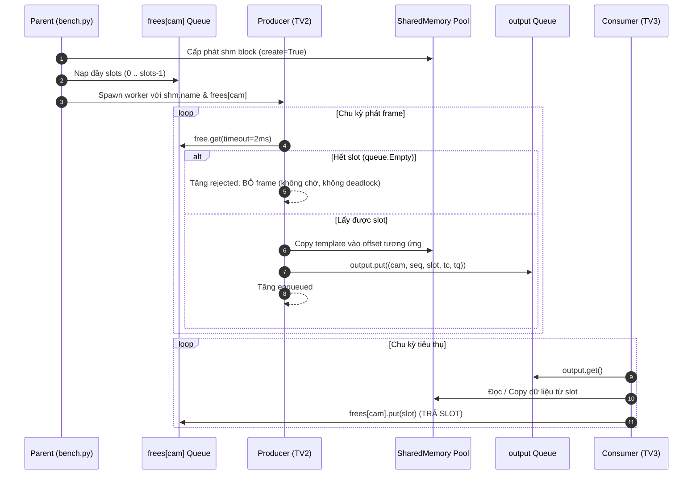

# Handoff H2: Metadata Contract và Quy Tắc Quản Lý Shared Memory

**Người bàn giao:** TV2 (Source & Memory Lead)  
**Người nhận:** TV1 (Integration Lead), TV3 (Metrics Lead)  
**Mục tiêu:** Thống nhất tuyệt đối cấu trúc dữ liệu, metadata và vòng đời slot bộ nhớ dùng chung (SharedMemory) giữa các tiến trình Producer và Consumer, bảo đảm không tràn RAM, không ghi đè dữ liệu và không rò rỉ tài nguyên trên hệ điều hành Windows 11 / Linux.

---

## 1. Cấu hình Payload và Định dạng Dữ liệu (RGB-D)

Mỗi virtual camera sinh một luồng dữ liệu mô phỏng cảm biến RGB-D (chuẩn Intel RealSense D400 series):

| Thành phần | Kiểu dữ liệu | Số kênh | Kích thước mảng | Dung lượng byte |
|---|---|---|---|---|
| **RGB** | `numpy.uint8` | 3 (RGB8) | `(H, W, 3)` | $H \times W \times 3$ bytes |
| **Depth** | `numpy.uint16` | 1 (Z16) | `(H, W)` | $H \times W \times 2$ bytes |
| **Frameset tổng** | `numpy.uint8` | Concatenated | `(H * W * 5,)` | **$5 \times H \times W$ bytes** (40 bit/pixel) |

- **Tính ngẫu nhiên độc lập:** Mỗi camera khởi tạo `numpy.random.default_rng(cfg['seed'] + cam)` để tạo template tĩnh độc lập, tránh tình trạng mọi camera có cùng dữ liệu giống hệt nhau.
- **Bytes per frame:**  
  $$\text{frame\_bytes} = \text{width} \times \text{height} \times 5$$

---

## 2. Phân vùng Bộ nhớ Dùng chung (SharedMemory Pool)

- Toàn bộ các camera dùng chung **một khối SharedMemory duy nhất** được cấp phát trước bởi tiến trình cha (Parent Process).
- **Tổng dung lượng pool:**  
  $$\text{pool\_bytes} = \text{frame\_bytes} \times \text{cameras} \times \text{slots}$$
- **Giới hạn an toàn (Memory Guard):**  
  Pool không được vượt quá $\min(1.5\text{ GB}, 35\% \times \text{RAM khả dụng})$. Nếu vượt quá, chương trình từ chối khởi chạy để bảo vệ hệ điều hành.
- **Ánh xạ địa chỉ (Slice Offset):**  
  Với camera `cam` ($0 \le \text{cam} < \text{cameras}$) và slot `slot` ($0 \le \text{slot} < \text{slots}$):  
  $$\text{offset} = (\text{cam} \times \text{slots} + \text{slot}) \times \text{frame\_bytes}$$  
  Vùng bộ nhớ của frame nằm chính xác tại:  
  `view[offset : offset + frame_bytes]`  
  **Cam kết:** Các slot và camera hoàn toàn độc lập, không có giao thoa hay ghi đè vùng nhớ của nhau.

---

## 3. Metadata Contract qua Queue IPC

Tiến trình Producer **chỉ gửi metadata** qua `output Queue`, tuyệt đối không gửi mảng dữ liệu ảnh qua Queue nhằm tránh chi phí serialization (pickle/IPC copy overhead).

Cấu trúc tuple metadata chuẩn gồm đúng 5 phần tử:

```python
(cam, seq, slot, t_capture, t_enqueue)
```

| Phần tử | Kiểu dữ liệu | Ý nghĩa | Đơn vị / Định dạng |
|---|---|---|---|
| `cam` | `int` | ID của camera ($0, 1, \dots, N-1$) | Số nguyên không âm |
| `seq` | `int` | Số thứ tự frame theo lịch ($0, 1, \dots$) | Bắt đầu từ 0 |
| `slot` | `int` | Chỉ số slot bộ nhớ đang chứa payload | $0 \le \text{slot} < \text{slots}$ |
| `t_capture` | `float` | Mốc thời gian bắt đầu copy template vào SharedMemory | `time.perf_counter()` (giây) |
| `t_enqueue` | `float` | Mốc thời gian đẩy metadata vào `output Queue` | `time.perf_counter()` (giây) |

Consumer sẽ sử dụng `t_capture` để tính toán toàn bộ độ trễ hệ thống (End-to-End Latency) và `t_enqueue` để tính thời gian chờ trong hàng đợi (Queue Wait Time).

---

## 4. Vòng đời Slot (Slot Ownership) và Quy tắc Thu hồi



### Quy tắc bất biến (Invariants):
1. **Producer KHÔNG BAO GIỜ ghi đè slot chưa trả:** Producer chỉ được ghi vào `slot` sau khi đã `get()` thành công từ `frees[cam]`.
2. **Consumer bắt buộc phải trả slot:** Bất kể frame được xử lý thành công (`completed`), bị bỏ qua do chính sách (`stale` trong Latest), hay kết thúc trễ (`completed_after_window`), Consumer **phải gọi hàm trả slot** `frees[cam].put(slot)` kèm theo ghi nhận trạng thái.
3. **Khi Shutdown:** Mọi frame còn tồn đọng trong hàng đợi hoặc buffer `pending` khi kết thúc cửa sổ đo đều được rút hết (drain) và trả slot về queue trước khi đóng SharedMemory.

---

## 5. Cơ chế Pacing và Báo cáo Kế toán Khung hình (Accounting)

- **Lập lịch cứng (Pacing):**  
  $$\text{deadline} = \text{start.value} + \frac{\text{seq}}{\text{fps}}$$
  Producer ngủ đến `deadline` bằng `stop.wait(max(0, deadline - time.perf_counter()))`.
- **Chống phát dồn (No catch-up burst):**  
  Nếu tại thời điểm thức dậy, `now - deadline >= 1 / fps` hoặc `now >= end`, Producer ghi nhận `counts[base + 3] += 1` (`schedule_missed`) và bỏ qua slot thời gian này. Không bao giờ phát dồn frame để bù cho thời gian trễ trước đó.
- **Phương trình kế toán bắt buộc ($100\%$ bảo toàn):**
  1. $\text{scheduled} = \text{attempted} + \text{schedule\_missed}$
  2. $\text{attempted} = \text{enqueued} + \text{rejected}$
  3. $\text{enqueued} = \text{completed} + \text{stale} + \text{late} + \text{shutdown\_backlog}$
  
Nếu bất kỳ điều kiện nào trên không thỏa mãn, run bị đánh dấu `status = 'invalid'`.

---

## 6. Vòng đời SharedMemory trên Windows 11 (Chuẩn R3)

Theo tài liệu Python 3.11 `multiprocessing.shared_memory`:
- Trên Windows, SharedMemory được quản lý thông qua named memory-mapped file handles của OS.
- **Tiến trình con (Producer Worker):**
  - Mở handle bằng `SharedMemory(name=name)`.
  - Khi hoàn thành: gọi `del view`, sau đó `shm.close()`.
  - **TUYỆT ĐỐI KHÔNG gọi `shm.unlink()`** trong tiến trình con vì sẽ làm hủy phân vùng của các worker khác và tiến trình cha.
- **Tiến trình cha (Parent Process):**
  - Khởi tạo khối nhớ ban đầu: `SharedMemory(create=True, size=...)`.
  - Giữ handle mở trong suốt phiên đo.
  - Sau khi tất cả worker đã `join()` và hàng đợi đã được giải phóng: gọi `shm.close()`, sau đó gọi `shm.unlink()` để giải phóng tài nguyên hệ điều hành.

